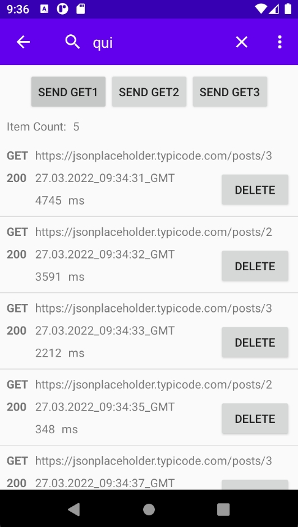

## Request Response Interceptor
A simple version of the request and response interceptor with full text search.

### To integrate into your application, you need:
1. Copy this project into your environment.
2. Add the RequestResponseInterceptor class to your builder OkHttpClient.Builder:

``` kotlin
@Inject  
lateinit var interceptor: Lazy<RequestResponseInterceptor>

val client: OkHttpClient = OkHttpClient.Builder().addInterceptor(interceptor).build()
```

3. And add to manifest:
``` xml  
<activity 
	android:name=".interceptor.InterceptorActivity" <!-- InterceptorActivity name --> 
	android:screenOrientation="portrait" 
	android:launchMode="singleTask" 
	android:taskAffinity="" 
	android:excludeFromRecents="true">
</activity>  
```

4. Add dependencies for Dagger to your Application class from TestApplication.
5. Delete unused classes that are no longer used (for example: TestApplication, Placeholder, PlaceHolderData, ...).

### Example

